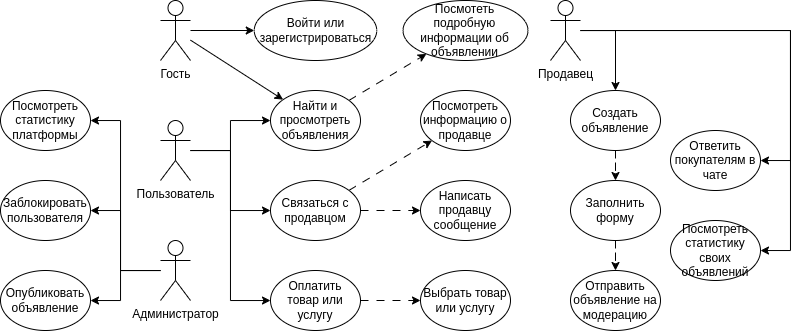
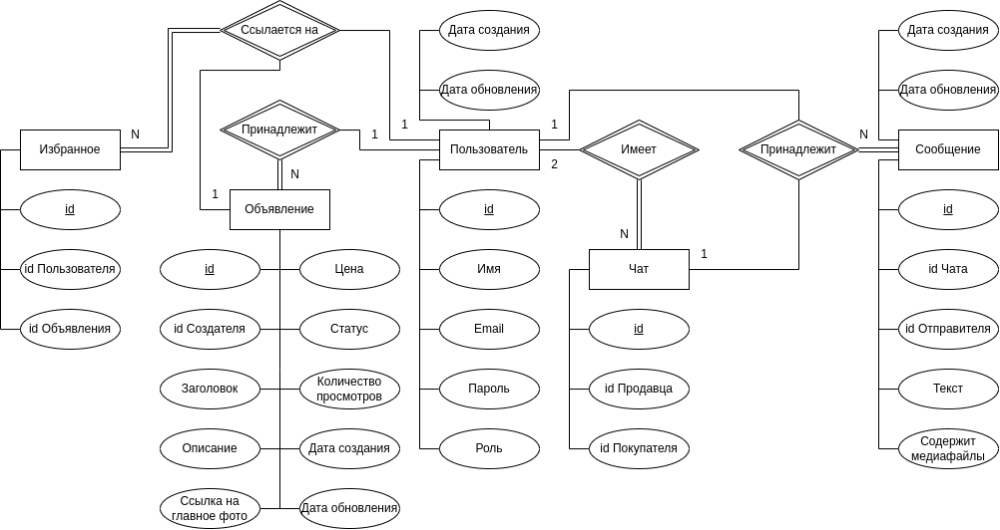
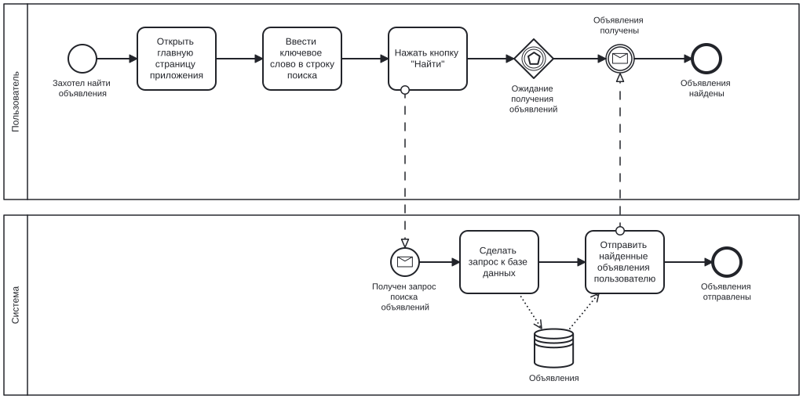
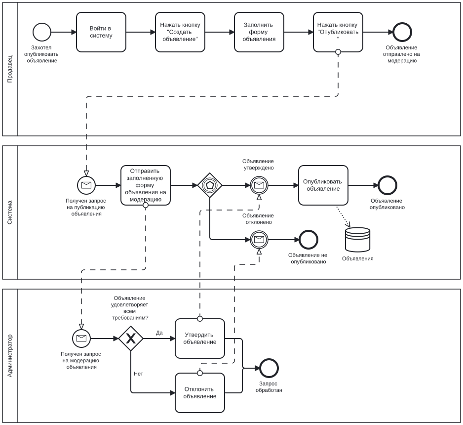
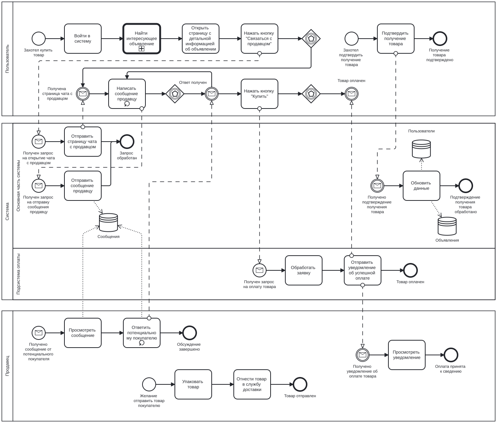

# NotAvito

## Краткое описание идеи проекта
<!-- 1 абзац, 3 предложения -->
NotAvito --- это приложение для размещения и поиска объявлений о продаже товаров и услуг.
Пользователи могут публиковать свои объявления, искать нужные товары и связываться с продавцами через платформу.

## Краткий анализ аналогичных решений
<!-- 1 таблица, 3 критерия -->
| Критерий | Avito | Юла | Etsy | NotAvito |
| - | - | - | - | - |
| Возможность продавать товары, находясь в России | + | + | - | + |
| Минималистичный пользовательский интерфейс | - | - | - | + |
| Возможность пользоваться приложением через терминал | - | - | - | + |

## Краткое обоснование целесообразности и актуальности проекта
<!-- 1 абзац -->
Современные сайты для размещения и поиска объявлений о продаже товаров и услуг нагружены излишей функциональностью.
В Avito есть истории и короткие видео с демонстрацией товаров.
В Юле в шапке сайта находятся статьи по типу "Как не попасться мошенникам?" или "Как публиковать объявления во ВКонтакте?".
В связи с этим, пользователям, которые знают, чего они хотят, приходится пробираться через множество баннеров, чтобы найти то, что им нужно --- в результате страдает пользовательский опыт.

## Краткое описание акторов (ролей)
### Пользователь
Просматривает объявления и связывается с продавцами.

### Продавец
Создает объявления о продаже товаров и услуг. 

### Администратор
Управляет платформой, модерирует объявления.

## Use-Case диаграмма

## ER-диаграмма сущностей

## Пользовательские сценарии
<!-- не менее 3 типовых сценариев, в текстовом виде, расписанных по шагам, для разных акторов -->
### Сценарий 1: Регистрация пользователя
1. Пользователь открывает главную страницу приложения.
2. Пользователь нажимает кнопку "Регистрация".
3. Пользователь заполняет форму регистрации.
4. Пользователь нажимает кнопку "Зарегистрироваться".
5. Система отправляет пользователю подтверждение регистрации.

### Сценарий 2: Поиск объявления
1. Пользователь открывает главную страницу приложения.
2. Пользователь вводит ключевое слово в строку поиска.
3. Пользователь нажимает кнопку "Найти".
4. Система отображает список объявлений, соответствующих ключевому слову.

### Сценарий 3: Публикация объявления
1. Продавец входит в систему.
2. Продавец нажимает кнопку "Создать объявление".
3. Продавец заполняет форму объявления.
4. Продавец нажимает кнопку "Опубликовать".
5. Система отправляет объявление на модерацию.
6. Администратор утверждает объявление.
7. Система публикует объявление и отображает его на главной странице.

### Сценарий 4: Покупка товара
1. Пользователь входит в систему.
2. Пользователь находит интересующее его объявление.
3. Пользователь открывает страницу с детальной информацией об объявлении.
4. Пользователь нажимает кнопку "Связаться с продавцом".
5. Система открывает чат между пользователем и продавцом.
6. Пользователь и продавец договариваются об условиях покупки (цена, способ доставки, и т.д.).
7. Пользователь нажимает кнопку "Купить" (если реализована возможность онлайн-оплаты).
8. Система обрабатывает платеж и уведомляет продавца о совершенной покупке.
9. Продавец отправляет товар покупателю.
10. Пользователь подтверждает получение товара в системе.

## Формализация ключевых бизнес-процессов
<!-- либо один основной комплексный бизнес процесс, либо 3-4 декомпозированных, небольших, используя BPMN-нотацию -->
### Поиск объявления

### Публикация объявления

### Покупка товара

