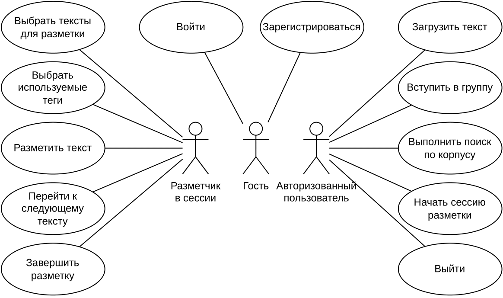
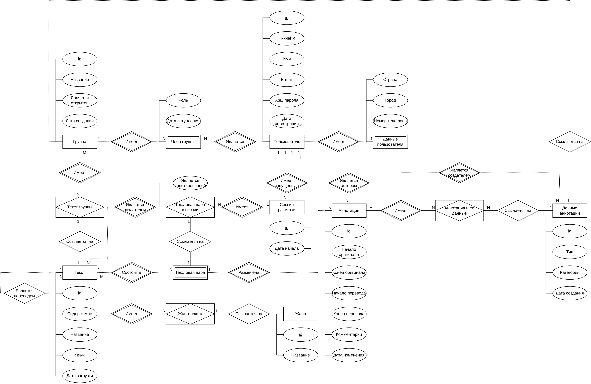
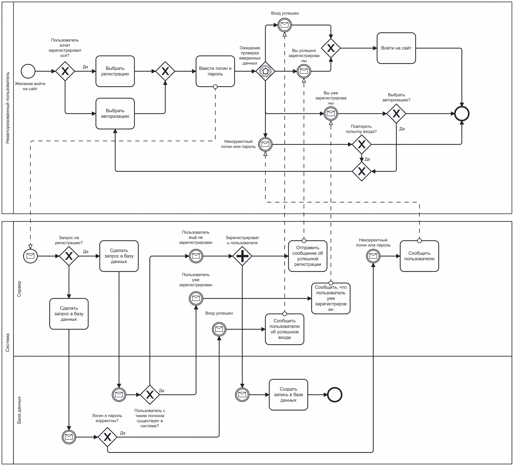

<!-- # Название проекта -->

# Название проекта - acltpcipciksntl

Application for Cooperative Labeling of Texts in Parallel Corpora and Interaction with Parallel Corpora Itself and it also is Kind of a Social Network for Text Labelers

<!-- АРМ разметчика параллельного корпуса технических текстов. -->

# Краткое описание идеи проекта
<!-- 1 абзац, 3 предложения -->

У заказчика есть корпус выровненных технических текстов, которые требуется разметить для последующего использования в параллельном корпусе.
Существуют приложения для разметки текстов, но ни одно из обнаруженных приложений не позволяет сохранять тексты и разметку в базе данных - только в виде файлов.
Также нет самого параллельного корпуса.

**Проблема: Отсутствие приложения, позволяющего размечать тексты и хранить их в полноценной БД (а не в виде XML файлов), имея при этом полный контроль над его исходным кодом.**

# Краткое описание предметной области
<!-- 1 абзац -->

Параллельные корпуса нужны для решения различных лингвистических задач: машинный перевод, обработка естественного языка, создание словарей.
Этапы создания и эксплуатации параллельного корпуса таковы:
1. Сбор языковых данных, текстов для формирования корпуса.
2. Выравнивание текстовых фрагментов.
3. Разметка текстов.
4. Поиск интересующей информации по корпусу.

# Краткий анализ аналогичных решений
<!-- 1 таблица, 3 критерия -->

| Решение | Позволяет размечать тексты | Разметка сохраняется в базе данных, над которой имеется полный контроль | Предоставляет интерфейс для взаимодействия с параллельным корпусом заказчика |
| - | - | - | - |
| [label-studio](https://labelstud.io/) | + | - | - |
| [NoSketch Engine](https://nlp.fi.muni.cz/trac/noske) | - | + | + |
| [OpenCorpora](https://opencorpora.org/) | - | + | + |
| acltpcipciksntl | + | + | + |

# Краткое обоснование целесообразности и актуальности проекта
<!-- 1 абзац -->

1. Имеется техническое задание, которое надо выполнить.
2. На рынке нет подходящих решений.

# Краткое описание акторов (ролей)

1. Гость - неавторизованный пользователь.
2. Авторизованный пользователь - пользователь, прошедший аутентификацию.
3. Разметчик - пользователь, находящийся в сессии разметки.

# Use-Case диаграмма

# ER-диаграмма сущностей в нотации Чена

# Пользовательские сценарии
<!-- не менее 3 типовых сценариев, в текстовом виде, расписанных по шагам, для разных акторов -->

1. Сценарий регистрации пользователя.
    1. Пользователь вводит логин и пароль.
    2. Пользователь вводит код-подтверждение.
    3. Пользователь заполняет информацию о себе.
    4. Пользователь принимает пользовательские соглашения.
    5. Пользователь авторизуется.
2. Сценарий загрузки текста.
    1. Пользователь авторизуется.
    2. Пользователь переходит в раздел загрузки текстов.
    3. Пользователь выбирает текст для загрузки.
    4. Пользователь заполняет информацию о тексте.
    5. Пользователь загружает текст в систему.
3. Сценарий начала разметки.
    1. Пользователь авторизуется.
    2. Пользователь переходит в раздел начала сессии разметки.
    3. Пользователь выбирает тексты для разметки.
    4. Пользователь выбирает или создает теги, которыми он будет пользоваться на протяжении сессии разметки.
    5. Пользователь начинает сессию разметки.

# Формализация ключевых бизнес-процессов
<!-- либо один основной комплексный бизнес процесс, либо 3-4 декомпозированных, небольших, используя BPMN-нотацию -->

